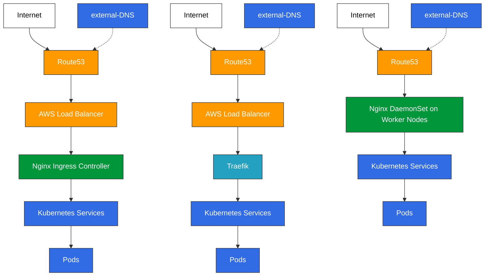
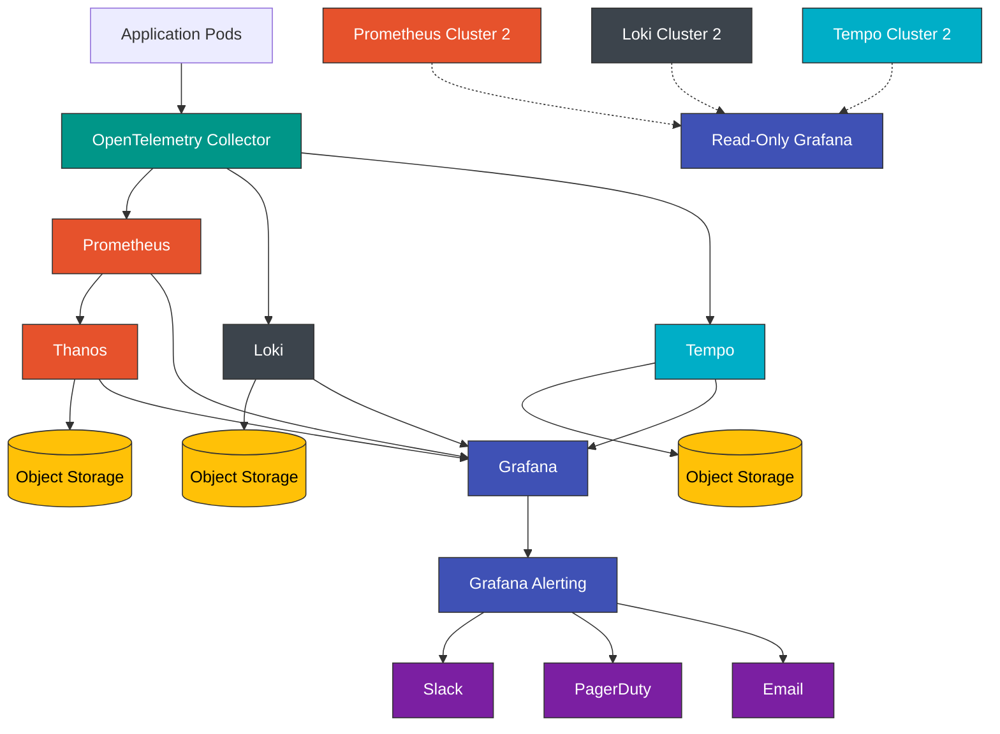

# AWS Service Catalog - EKS Cluster with Add-ons

This repository contains Terraform modules to create an AWS Service Catalog product for EKS clusters with optional add-ons.

## Deployment Using GitLab CI/CD

This repository is designed to be deployed via GitLab CI/CD pipelines, providing a flexible and customizable approach to EKS cluster provisioning.

### GitLab CI/CD Integration

- The repository includes a `.gitlab-ci.yml` file that defines the deployment pipeline
- Users can include this pipeline in their own GitLab repositories to deploy EKS clusters
- Configuration is handled through CI/CD variables or a terraform.tfvars file
- Uses GitLab-managed Terraform state with cluster-specific state paths
- Dynamically creates AWS resources only for the add-ons you enable
- Built-in GitLab OIDC authentication with AWS:
  - Automatically creates a GitLab OIDC provider in AWS
  - Generates a properly configured IAM role for GitLab
  - Grants the role access to the EKS cluster through access entries
  - Enables secure, token-based authentication without static credentials

### How to Use in Your Project

1. Create a new GitLab project or use an existing one
2. Include our pipeline in your own `.gitlab-ci.yml`:

```yaml
include:
  - project: 'your-org/eks-module'
    ref: main
    file: '.gitlab-ci.yml'

variables:
  CLUSTER_NAME: "my-eks-cluster"
  VPC_ID: "vpc-12345"
  SUBNET_IDS: '["subnet-123", "subnet-456", "subnet-789"]'
  NODE_SCALING_METHOD: "karpenter"
  ENABLE_AWS_LOAD_BALANCER_CONTROLLER: "true"
  
  # GitLab ID variables (used for OIDC trust configuration)
  # These are automatically provided by GitLab runners
  # CI_JOB_JWT_V2: ${CI_JOB_JWT_V2}  # This gets injected automatically
  
  # Add other configuration options as needed
```

3. No additional AWS credentials are needed - the OIDC integration handles authentication securely
4. Run the pipeline to deploy your EKS cluster

For detailed instructions, see our [GitLab CI/CD Guide](./docs/gitlab-ci-guide.md).

## Architecture Overview

This solution implements a hybrid deployment approach where:
1. Terraform provisions AWS infrastructure (EKS cluster, IAM roles, OIDC providers)
2. GitLab CI/CD installs Kubernetes components (Helm charts, Kubernetes manifests)

## Key Components

### 1. Service Catalog Product Parameters
- Core cluster parameters (VPC, subnets, node groups, etc.)
- Support for custom AMIs via launch templates
- Add-on selection dropdowns with Yes/No options
- Sensitive GitLab token for pipeline triggering

### 2. Custom AMI Support
- Use your own AMIs for EKS worker nodes
- Automated launch template creation with proper bootstrap script
- Support per-node-group AMI configuration
- Properly configures custom AMIs to join the EKS cluster

### 3. Terraform Module Structure
- Main EKS cluster using `terraform-aws-modules/eks`
- Conditional IAM role modules for each add-on (only created if selected)
- OIDC providers for EKS and GitLab authentication
- JSON payload generation for GitLab pipeline
- Pipeline trigger using `null_resource` and `curl`

### 4. Dynamic IAM Role Creation
- Each add-on gets its own conditional module for IAM/IRSA roles
- Roles are created only when the add-on is selected
- Proper OIDC provider bindings for service accounts
- Least-privilege permissions per component

### 5. GitLab Pipeline Integration
- Receives structured JSON payload with cluster info and add-on selections
- Authenticates using OIDC federation (no long-term credentials)
- Installs only selected components using conditional job rules
- Uses local Helm charts with custom values

## Available Add-ons

### Core Add-ons
- CoreDNS (installed by default with EKS)
- kube-proxy (installed by default with EKS)
- vpc-cni (installed by default with EKS)
- Amazon EBS CSI Driver (enabled by default for persistent volumes)

### Optional Add-ons
- AWS Load Balancer Controller
- Node Scaling Options:
  - Karpenter (recommended, modern autoscaling)
  - Cluster Autoscaler (traditional autoscaling)
- KEDA (Kubernetes Event-driven Autoscaling)
- External DNS 
- Prometheus
- AWS Secrets & Configuration Provider (ASCP)
- Cert Manager
- NGINX Ingress Controller
- AWS Distro for OpenTelemetry (ADOT)
- Fluent Bit (log collection)
- Amazon EFS CSI Driver (optional, for ReadWriteMany volumes)

## Usage

1. Deploy this Terraform code to your AWS account
2. Create a Service Catalog product using the template in `service-catalog-template/`
3. Provision the product from Service Catalog with your desired parameters
4. The product will create the EKS cluster and trigger the GitLab pipeline for Kubernetes components

## Requirements

- Terraform >= 1.0.0
- AWS provider >= 4.0
- AWS CLI >= 2.0
- GitLab project for pipeline integration

## Security Considerations

- Sensitive GitLab token directly embedded in the Service Catalog template with NoEcho protection
- Token has limited pipeline-triggering scope only (not a full GitLab access token)
- OIDC-based authentication for all operations
- IAM roles with minimal required permissions
- No cross-account access required

### GitLab Token Security

The GitLab pipeline trigger token is embedded directly in the Service Catalog template with `NoEcho: true` to prevent it from appearing in CloudFormation logs and console. This token:

- Has limited scope (only triggers specific pipelines)
- Cannot access repositories or other GitLab resources
- Is only used for the initial pipeline trigger to deploy Kubernetes add-ons
- Can be rotated by updating the template and redeploying (without affecting existing clusters)

## Adding New Add-ons

To add a new add-on to the Service Catalog product:

1. Add a new parameter in the Service Catalog template
2. Create a conditional IAM module for the add-on in `modules/add-ons/`
3. Include the add-on data in the GitLab payload
4. Add corresponding Helm chart and pipeline job in the GitLab repository

Error message: operation error DynamoDB: PutItem, https response error
│ StatusCode: 400, RequestID:
│ KD1IRQS23UQ4L9LJ54AE5MUQ7JVV4KQNSO5AEMVJF66Q9ASUAAJG,
│ ConditionalCheckFailedException: The conditional request failed
│ Lock Info:
│   ID:        ae7a28de-48e7-0c35-416b-36b4227b194c
│   Path:      psb-terraform-state-bucket/eks-module-2.tfstate
│   Operation: OperationTypePlan
│   Who:       root@runner-t3qyxf-project-7120-concurrent-0
│   Version:   1.6.6
│   Created:   2025-05-06 18:14:47.949468246 +0000 UTC
│   Info:      


aws ec2 describe-vpc-endpoints --filters "Name=vpc-id,Values=your-vpc-id" "Name=service-name,Values=com.amazonaws.region.eks"

# Get subnet ID of your EC2 instance
SUBNET_ID=$(aws ec2 describe-instances --instance-ids your-instance-id --query "Reservations[0].Instances[0].SubnetId" --output text)

# Check route table associated with this subnet
ROUTE_TABLE_ID=$(aws ec2 describe-route-tables --filters "Name=association.subnet-id,Values=$SUBNET_ID" --query "RouteTables[0].RouteTableId" --output text)
aws ec2 describe-route-tables --route-table-ids $ROUTE_TABLE_ID


# EKS Architecture Guide: Ingress and Observability

## 1. Ingress Architecture Options



### 1.1 Route53 → AWS Load Balancer → Nginx Ingress

This is the standard, AWS-recommended architecture for EKS clusters.

**Benefits:**
- **AWS WAF Integration**: Protection against common web exploits and attacks
- **AWS Shield**: DDoS protection at the edge
- **Health Checks**: Automatic node health monitoring and traffic routing
- **SSL Termination**: AWS Certificate Manager integration
- **Access Logs**: Central logging of all ingress traffic
- **Sticky Sessions**: Session affinity for stateful applications
- **Cross-zone Load Balancing**: Even distribution across AZs

**Configuration Notes:**
- Requires AWS Load Balancer Controller in the cluster
- Ingress resources need specific AWS annotations
- external-DNS creates Route53 records pointing to the AWS LB

### 1.2 Route53 → AWS Load Balancer → Traefik

Modern alternative using Traefik instead of Nginx for advanced traffic management.

**Benefits (in addition to standard AWS LB benefits):**
- **IngressRoute CRDs**: More flexible routing definitions
- **Middleware Concept**: Reusable routing components
- **Better Dashboard**: Enhanced visibility into traffic flows
- **Modern API Gateway Features**: Rate limiting, circuit breaking
- **WebSocket Support**: Better handling of persistent connections
- **Canary Deployments**: Advanced traffic splitting capabilities
- **Let's Encrypt Integration**: Automated certificate management
- **Reduced Annotation Complexity**: Less reliance on lengthy annotations

**Future-Proofing Advantages of Traefik over Nginx:**
- Better CRD-based configuration model
- More cloud-native design principles
- Superior middleware chain concept
- Enhanced observability features
- More modern architecture (designed for containerized workloads)
- Better separation of concerns
- Regular feature updates focused on Kubernetes

### 1.3 Route53 → Nginx (deployed as DaemonSet)

The "direct-to-node" approach using DNS round-robin instead of a dedicated load balancer.

**Benefits:**
- **Cost Efficiency**: No AWS Load Balancer charges
- **Simplicity**: Fewer moving parts in the architecture
- **Reduced Latency**: One less hop in the traffic flow
- **Easier Troubleshooting**: Direct node access for debugging

**Limitations:**
- **No WAF Protection**: Missing AWS WAF integration
- **No DDoS Protection**: No AWS Shield at the edge
- **Limited Health Checks**: DNS can't detect node failures
- **No SSL Termination at Edge**: Certificate management handled by Nginx
- **No Access Logs Aggregation**: Logs distributed across nodes
- **Network Exposure**: Worker nodes directly exposed to internet
- **Less Sophisticated Load Balancing**: Simple DNS round-robin

## 2. Observability Stack

### 2.1 Self-Hosted Observability (Multi-Cloud)

**Core Components (Helm Charts):**
- **Prometheus** (kube-prometheus-stack)
- **Thanos** (thanos)
- **Grafana** (grafana)
- **Loki** (loki-stack)
- **Promtail** (included with loki-stack)
- **Tempo** (tempo)
- **OpenTelemetry Collector** (opentelemetry-collector)

**Benefits of Self-Hosted for Multi-Cloud:**
- **Consistency**: Identical deployments across AWS, Azure, GCP
- **Portability**: Easy migration between cloud providers
- **Control**: Complete configuration flexibility
- **Knowledge Transfer**: Skills applicable across environments
- **No Vendor Lock-in**: Independent from cloud-specific services
- **Feature Access**: Immediate access to open-source updates
- **Upgrade Control**: Schedule upgrades on your timeline
- **Cost Optimization**: Tune resource allocation for your needs

### 2.2 AWS Managed Services (AWS-Only)

If staying exclusively on AWS for the next 5+ years:

**Managed Components:**
- **Amazon Managed Service for Prometheus**
- **Amazon Managed Grafana**
- **Amazon CloudWatch for logs** (alternative to Loki)
- **AWS X-Ray** (alternative to Tempo)
- **AWS Distro for OpenTelemetry** (ADOT)

**Benefits of AWS Managed Services:**
- **Reduced Operational Overhead**: AWS handles upgrades and scaling
- **Integration with AWS Services**: Native connections to AWS resources
- **IAM-Based Security**: Use existing AWS security controls
- **SLA-Backed Reliability**: AWS service-level agreements
- **Simplified Deployment**: Less infrastructure to manage
- **AWS Support**: Access to AWS technical support

### 2.3 Alerting Architecture

**Single Grafana Alerting System:**
- Unified alerting across all data sources (metrics, logs, traces)
- Built-in Alertmanager functionality
- Consistent interface for creating and managing alerts
- Integrated notification channels
- Alert grouping and deduplication
- Support for silences and maintenance windows

**Alert Sources:**
- Prometheus metrics
- Loki log patterns
- Tempo trace conditions
- Cross-source alerts (combining multiple data types)

### 2.4 Thanos for Long-Term Metric Storage

**Key Functions:**
- Extends Prometheus retention capabilities
- Provides global query view across clusters
- Handles downsampling for efficient storage
- Enables high availability for Prometheus
- Uses object storage (S3) for long-term data

**Configuration Notes:**
- Only stores metrics (not logs or traces)
- Complements Prometheus, doesn't replace it
- Use Thanos Sidecar with Prometheus
- Thanos Store for accessing object storage
- Thanos Query for unified querying

### 2.5 Read-Only Grafana for Cross-Cluster Visibility

**Implementation:**
- Deploy "view-only" Grafana instance with datasources pointing to other clusters
- Configure read-only permissions to prevent changes
- Use consistent dashboards across environments
- Enable exemplars for metrics-to-traces correlation
- Implement federated access controls

**Benefits:**
- Single pane of glass for multiple clusters
- No cross-cluster dependencies
- Preserves isolation between environments
- Enables cross-service troubleshooting
- Supports team-specific views

### 2.6 Single Grafana Alerting

**Centralized Configuration:**
- One alert system for all data types
- Alert rules stored as code for version control
- Configurable notification policies
- Customizable alert templates
- Integrations with incident management tools

**Integration Points:**
- Slack/Teams for team notifications
- PagerDuty/OpsGenie for on-call management
- Email for non-urgent alerts
- Webhooks for custom integrations
- Mobile app notifications

## 3. Complete Observability Stack



This architecture provides a comprehensive, future-proof approach to both ingress management and observability, with options for both AWS-specific and multi-cloud environments.


yq -n '.service.annotations."service.beta.kubernetes.io/aws-load-balancer-subnets" = env(AWS_SUBNET_IDS)' > values-override.yaml
    #- |
    #  yq -n '.service.annotations["external-dns.alpha.kubernetes.io/hostname"] = env(AWS_DOMAIN_NAME)' > values-override.yaml

