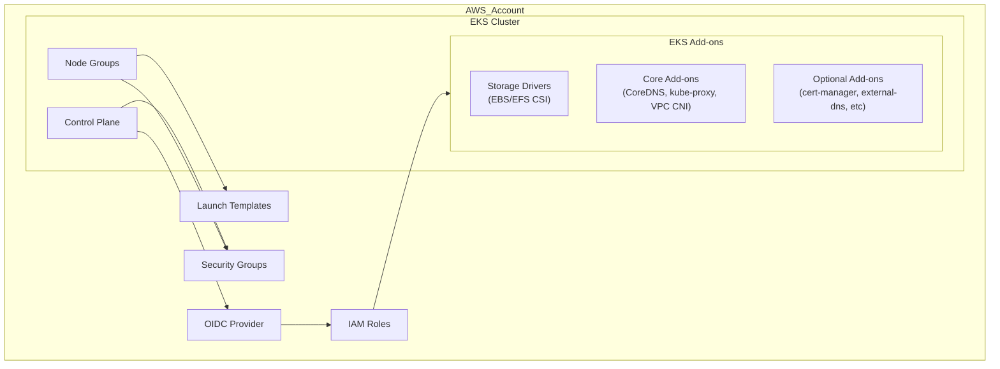
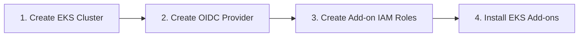
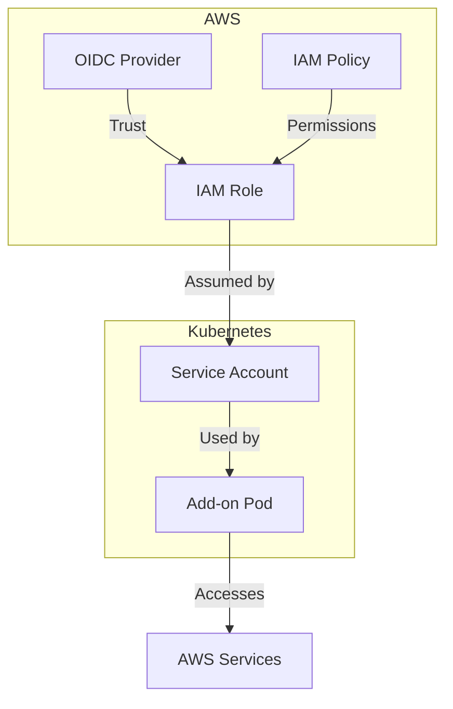

# AWS EKS Architecture

This document provides a high-level architecture overview of the EKS cluster deployment using Terraform modules.

## Core Architecture

## Deployment Flow

## Component Overview

### 1. EKS Control Plane
- Managed Kubernetes control plane hosted by AWS
- Configured with public and/or private endpoint access
- Custom security groups for API server access
- Uses `cluster_iam_role_arn` to support pre-created IAM roles

### 2. EKS Node Groups
- Managed node groups with customizable instance types
- Custom launch templates for advanced configuration
- Automatic scaling configurations
- Uses `node_iam_role_arn` to support pre-created IAM roles

### 3. Launch Templates
- Custom user data for node bootstrapping
- Root volume configuration (gp3, encrypted storage)
- Enhanced metadata security (IMDSv2)
- Tags for cost allocation and resource management

### 4. Security Groups
- Cluster security group: Controls access to the Kubernetes API server
- Node security group: Controls traffic to/from worker nodes
- Added rules to allow VPC CIDR access to the cluster

### 5. IAM Integration
- Support for IAM Roles for Service Accounts (IRSA)
- EKS OIDC provider for secure pod authentication
- Scoped IAM permissions following least privilege principle
- Conditional IAM role creation based on feature flags

### 6. Add-ons Architecture

Each add-on follows the same pattern:
1. IAM role with trusted relationship to the EKS OIDC provider
2. Add-on-specific policy with minimal permissions required
3. Service account binding in Kubernetes
4. Native EKS add-on or Helm chart deployment

## Two-Phase Deployment

The architecture supports a two-phase deployment approach to resolve circular dependencies:

1. **Phase 1**: Deploy EKS cluster without add-ons
   - EKS control plane
   - Node groups
   - OIDC provider

2. **Phase 2**: Deploy add-ons using the OIDC provider from Phase 1
   - Create IRSA roles for add-ons
   - Install EKS managed add-ons
   - Deploy additional components

This approach solves the "chicken-and-egg" problem with the OIDC provider, which is needed for add-on roles but is only created after the EKS cluster exists.