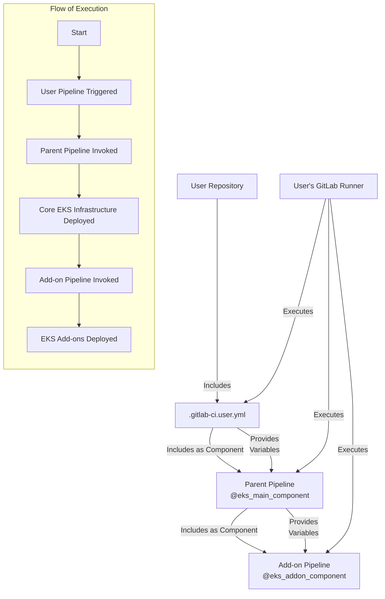

# GitLab CI/CD Architecture for EKS Pipeline

This document explains the architecture of our GitLab CI/CD pipeline for EKS cluster deployment, specifically focusing on how the three main YAML files interact and how they execute on user GitLab runners.

## Overview

Our GitLab CI/CD pipeline for EKS cluster deployment is split into three main configuration files:

1. **Parent Pipeline** (`.gitlab-ci.yml`) - The main orchestrator
2. **Add-on Pipeline** (`.gitlab-ci.add-on.yml`) - Specialized for EKS add-ons
3. **User Pipeline** (`.gitlab-ci.user.yml`) - Custom user configuration

These files work together in a component-based architecture, allowing for flexibility, reusability, and clear separation of concerns.

## Architecture Diagram



## Pipeline Components Explained

### 1. User Pipeline (`.gitlab-ci.user.yml`)

**Purpose**: This is the entry point and customization layer for the pipeline.

**Key Characteristics**:
- Lives in the user's repository
- Defines user-specific variables (cluster name, region, etc.)
- Controls which add-ons to enable
- Includes the parent pipeline as a component
- Sets trigger conditions (when to run the pipeline)

**Example**:
```yaml
include:
  - component: $CI_SERVER_FQDN/psb/containers/eks-pipeline/@eks_main_component
    input:
      CLUSTER_NAME: ${CLUSTER_NAME}
      ENABLE_KARPENTER: "true"
      # ... other customizations
```

### 2. Parent Pipeline (EKS Main Component)

**Purpose**: Orchestrates the overall deployment process and sets up core EKS infrastructure.

**Key Characteristics**:
- Stored as a reusable component in GitLab
- Creates the EKS cluster and core infrastructure
- Sets up node groups, networking, and IAM roles
- Calls the add-on pipeline as needed
- Provides consistent deployment practices

**How it's Referenced**:
- Included as a component via GitLab's Component Pipelines feature
- Referenced with `@eks_main_component` identifier

### 3. Add-on Pipeline (EKS Add-on Component)

**Purpose**: Handles the deployment of individual EKS add-ons like Karpenter, ExternalDNS, etc.

**Key Characteristics**:
- Stored as a reusable component in GitLab
- Contains specialized jobs for each add-on
- Conditionally runs jobs based on enabled flags
- Manages add-on configurations and dependencies
- Handles version management for add-ons

**How it's Referenced**:
- Included by the parent pipeline
- Referenced with `@eks_addon_component` identifier

## Execution Flow

1. **Trigger**: The user pushes code or manually triggers the pipeline.
2. **User Pipeline**: `.gitlab-ci.user.yml` runs on the user's GitLab runner.
3. **Parent Inclusion**: The user pipeline includes the parent pipeline component.
4. **Core Deployment**: The parent pipeline deploys the core EKS infrastructure.
5. **Add-on Inclusion**: The parent pipeline includes the add-on pipeline component.
6. **Add-on Deployment**: Enabled add-ons are deployed by the add-on pipeline.

## Runtime Environment

All pipeline components run on the **user's GitLab runners**. This is important to understand:

- The pipelines execute in the user's infrastructure/environment
- The runners need appropriate permissions to create AWS resources
- Network access is based on the runner's configuration
- Secrets and credentials are managed in the user's GitLab instance

## Variable Flow

Variables are passed down through the pipeline hierarchy:

1. User-defined variables in `.gitlab-ci.user.yml`
2. Passed to the parent pipeline via the `input:` section
3. Parent pipeline passes relevant variables to the add-on pipeline
4. Environment-specific overrides can happen at any level

## Benefits of This Architecture

1. **Separation of Concerns**: Each file has a clear, specific purpose
2. **Reusability**: Core components can be reused across multiple projects
3. **Standardization**: Consistent deployment practices across teams
4. **Flexibility**: Users can customize without modifying core components
5. **Maintainability**: Core components can be updated centrally
6. **Version Control**: Components can be versioned independently

## Security Considerations

- All pipelines run on user-controlled runners
- IAM permissions are scoped to specific resources
- Sensitive configuration is passed via GitLab CI/CD variables
- No credentials are hardcoded in pipeline files

## Customization Points

Users can customize the deployment by:

1. Enabling/disabling specific add-ons in `.gitlab-ci.user.yml`
2. Providing custom configuration values
3. Overriding default variables
4. Adding pre/post deployment steps in their user pipeline

## Conclusion

This component-based GitLab CI/CD architecture provides a powerful, flexible framework for EKS deployments. By separating user configuration from core functionality, we achieve both standardization and customization while maintaining security and reliability.
