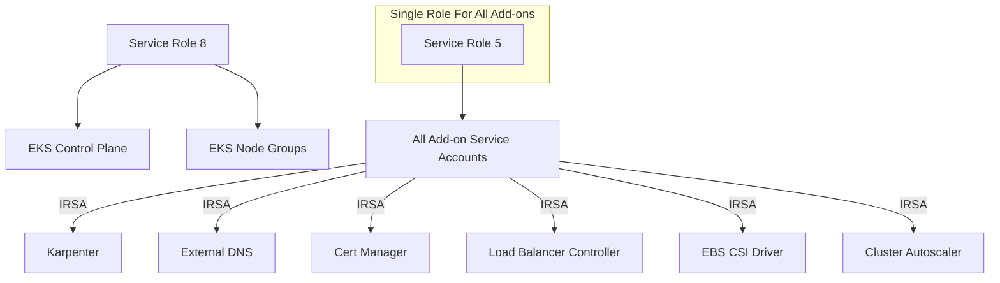
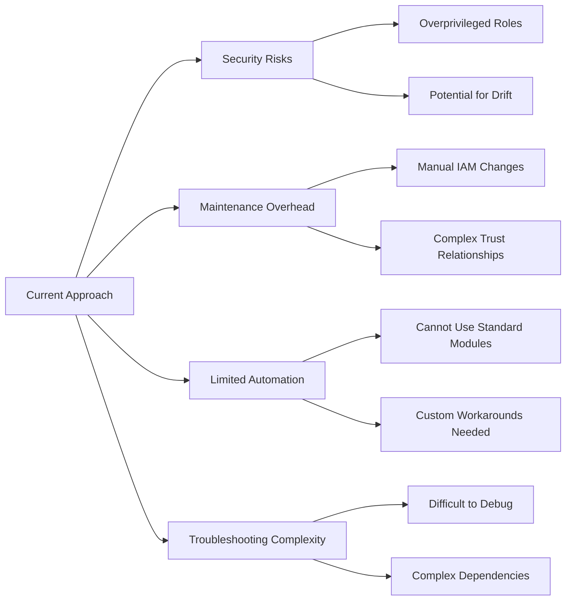
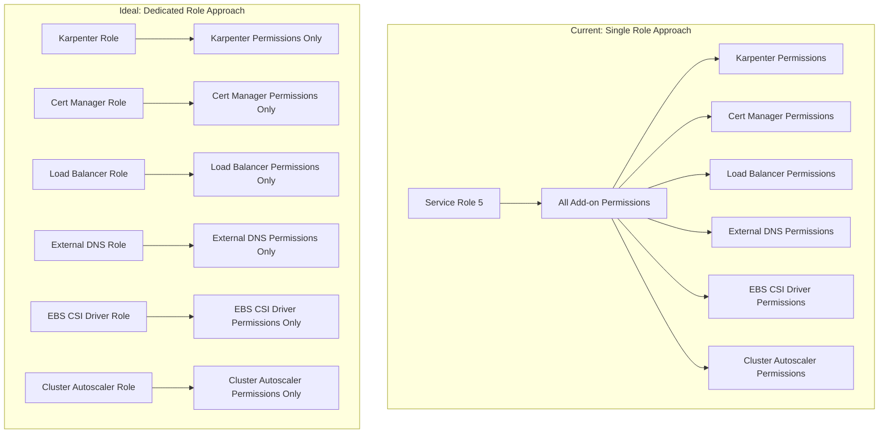
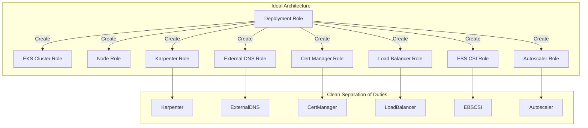
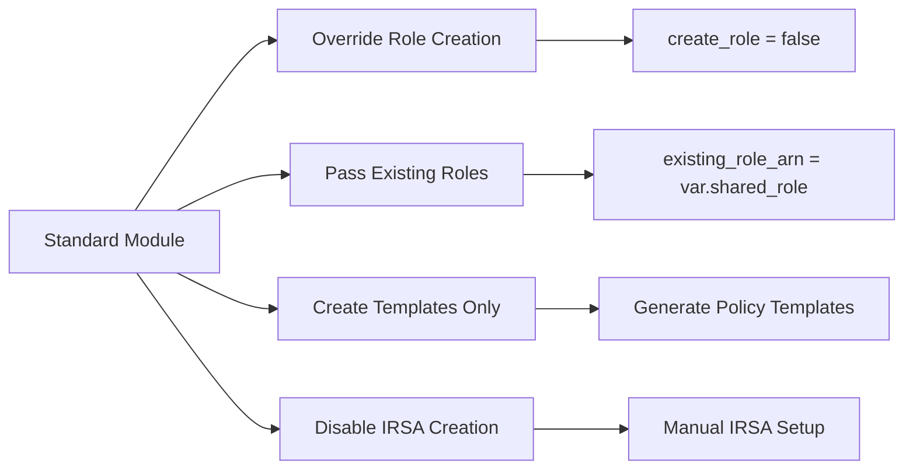

# IAM Restrictions: Impact on EKS Automation

## Current IAM Restrictions

Our organization has implemented strict IAM policies that impact our ability to fully automate EKS cluster and add-on deployments:

1. **No IAM Role Creation**: We cannot create new IAM roles through Terraform or other automation tools
2. **No Policy Attachment**: We cannot attach managed policies to existing roles (we must use inline policies)
3. **Limited Role Selection**: We must use pre-defined service roles that are managed outside our team

## Current Workaround Approach

To work within these constraints, we've developed a workaround that leverages two existing service roles:

### Approach Details

1. **Service Role 8**:
   - Used for EKS control plane and node groups
   - Permissions required for basic EKS infrastructure

2. **Service Role 5**:
   - Single role used for all add-on service accounts via IRSA
   - Contains combined permissions from all add-ons
   - Trust relationship modified to allow all required service accounts

3. **Terraform Implementation**:
   - We create inline policy templates in Terraform
   - We use `create_role = false` for all modules
   - We pass existing role ARNs to our modules
   - Instance profiles are created referencing existing roles

## Impact on Automation

This approach has several drawbacks:

### Security Implications

Using a single role (Service Role 5) for all add-ons violates the principle of least privilege:

### Maintenance Risks

1. **Role Interdependencies**:
   - If someone modifies Service Role 5, it could break multiple add-ons
   - Changes to trust relationships may affect all add-ons

2. **Change Management**:
   - Any add-on permission change requires updating the shared role
   - Potential for permission conflicts between add-ons

## Ideal Solution

The ideal approach would involve:

### Benefits of Ideal Solution

1. **Improved Security**:
   - Least privilege for each add-on
   - Clear separation of permissions

2. **Better Automation**:
   - Use standard Terraform modules without modification
   - Leverage full automation capabilities
   - Simplified CI/CD pipelines

3. **Reduced Maintenance Overhead**:
   - Changes to one add-on don't affect others
   - Clearer audit trail for permissions
   - Easier troubleshooting

## Recommendation for Management

While our current approach is functional, we recommend:

1. **Create a dedicated EKS deployment role** with permissions to:
   - Create IAM roles
   - Attach IAM policies
   - Manage trust relationships

2. **Implement this role for CI/CD pipelines** to:
   - Enhance security through least privilege
   - Fully leverage automation capabilities
   - Reduce maintenance overhead
   - Simplify future updates

This approach would dramatically improve our EKS deployment architecture while maintaining organizational security standards.

## Current Terraform Adaptations

To accommodate the restrictions, we've made significant adaptations to standard Terraform modules:

### Example: Karpenter Module Adaptations

For Karpenter specifically, we've adapted the module to:

1. Set `create_iam_role = false` to prevent role creation
2. Set `enable_irsa = true` but without creating the role
3. Create instance profile using existing node role
4. Disable spot instance components as we use only reserved instances
5. Output resource names for Helm chart configuration

These adaptations allow us to deploy the infrastructure while working within the IAM restrictions.

## Conclusion

Our current approach is working and doesn't block development, but it introduces:
- Security risks through overprivileged roles
- Maintenance overhead from complex workarounds
- Reduced automation capabilities

A dedicated EKS deployment role with IAM creation permissions would allow us to implement a more secure, maintainable, and automated solution.
